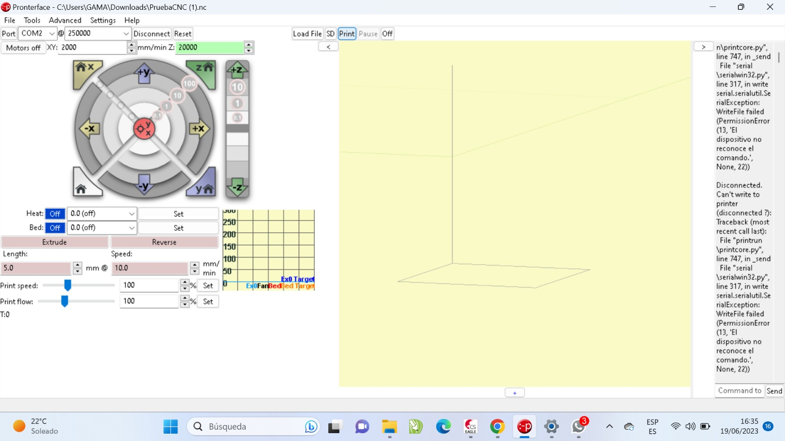
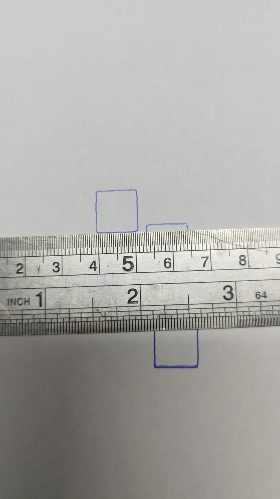

# Tesis: Diseño y prototipado de una máquina CNC de 4 ejes para el manufacturado de piezas pequeñas

## Descripción

En este repositorio encontrarás una colección de archivos relacionados con el diseño e implementación de una máquina CNC de 4 ejes para el manufacturado de piezas pequeñas. El objetivo principal de este proyecto es explicar lo desarrollado hasta el momento sobre el tema de tesis.

## Contenido

# Diseño de la máquina CNC
Primero se tuvo que diseñar la máquina CNC de 3 ejes en Fusion 360, en la siguiente imagen se puede ver la máquina CNC de 3 ejes que originalmente se tenia diseño y que ya fue implementado.

En el siguiente video se puede ver el funcionamiento de la máquina CNC usando el software de Marlin, cuya interfaz gráfica se puede ver en la siguiente imagen.

[(Link del video)](https://drive.google.com/file/d/1PD01dJX2HNzqJeuAOO1hhQPEYfSpYTAr/view?usp=drive_link)

En el anterior video se dibujaron cuadrados de 1cm x 1cm, para comprobar estos resulktados se realizaron las mediciones correspondientes, donde se comprueba que la mpáquina si esta respondiendo a los comando NC que se le esta cargando.

Esto se lográ al saber con que tornillo sin fin se está trabajando en la máquina, ya que los motores NEMA 17 están conectados a ellos, por lo que se tiene que realizar el siguiente cálculo para saber el avance del actuador:

$$
(1 vuelta= hilos \cdot paso=4*\frac{1}{4}) = 1mm
$$

El motor paso a paso NEMA 17 tiene que estar configurado a 1/4 de pasos para que el tornillo de 4 hilos tenga una precisión de avance de 1mm cuando se gire una vuelta. Entonces, en el informe de la tesis ([Link](https://www.overleaf.com/read/zrbwjbkmgxcb)), se tiene el cálculo para comprobar que los NEMA 17 en lo ejes XYZ si podrán realizar la tarea del fresado. 

El sistema Actuador que se diseño para implementar el cuarto eje, se puede ver en la siguiente imagen que se opto por usar engranajes planetarios usando un motor de 67Kg.cm de torque que se obtuvo de la tienda Naylamp Mechatronics ([Link](https://naylampmechatronics.com/motores-dc/817-motor-dc-37d-12v-35rpm-con-encoder.html)). El diseño de estos engranajes planetarios se puede ver en la siguiente imagen.

