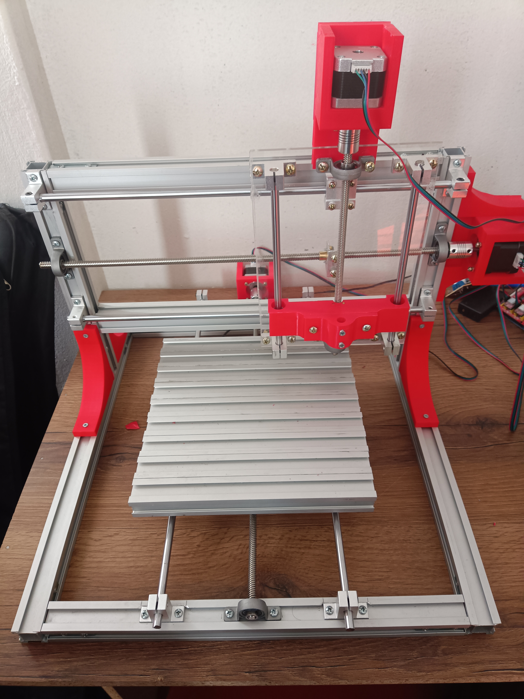

# Tesis: Diseño y prototipado de una máquina CNC de 4 ejes para el manufacturado de piezas pequeñas

## Descripción

En este repositorio encontrarás una colección de archivos relacionados con el diseño e implementación de una máquina CNC de 4 ejes para el manufacturado de piezas pequeñas. El objetivo principal de este proyecto es explicar lo desarrollado hasta el momento sobre el tema de tesis.

## Contenido

# Diseño de la máquina CNC
Primero se tuvo que diseñar la máquina CNC de 3 ejes en Fusion 360, en la siguiente imagen se puede ver la máquina CNC de 3 ejes que originalmente se tenia diseño y que ya fue implementado.

En el siguiente video se puede ver el funcionamiento de la máquina CNC usando el software de Marlin

El sistema Actuador que se diseño para implementar el cuarto eje, se puede ver en la siguiente imagen que se opto por usar engranajes planetarios usando un motor de 67Kg.cm de torque que se obtuvo de la tienda ([Naylamp Mechatronics](https://naylampmechatronics.com/motores-dc/817-motor-dc-37d-12v-35rpm-con-encoder.html)) 

El repositorio está organizado de la siguiente manera:

- **Carpeta 1**: Descripción breve de los archivos contenidos en esta carpeta.

- **Carpeta 2**: Descripción breve de los archivos contenidos en esta carpeta.
- **Carpeta 3**: Descripción breve de los archivos contenidos en esta carpeta.

Además, se incluyen los siguientes elementos importantes:

- **Archivo A**: Descripción breve del archivo A y su relevancia para el proyecto.
- **Archivo B**: Descripción breve del archivo B y su relevancia para el proyecto.
- **Archivo C**: Descripción breve del archivo C y su relevancia para el proyecto.
